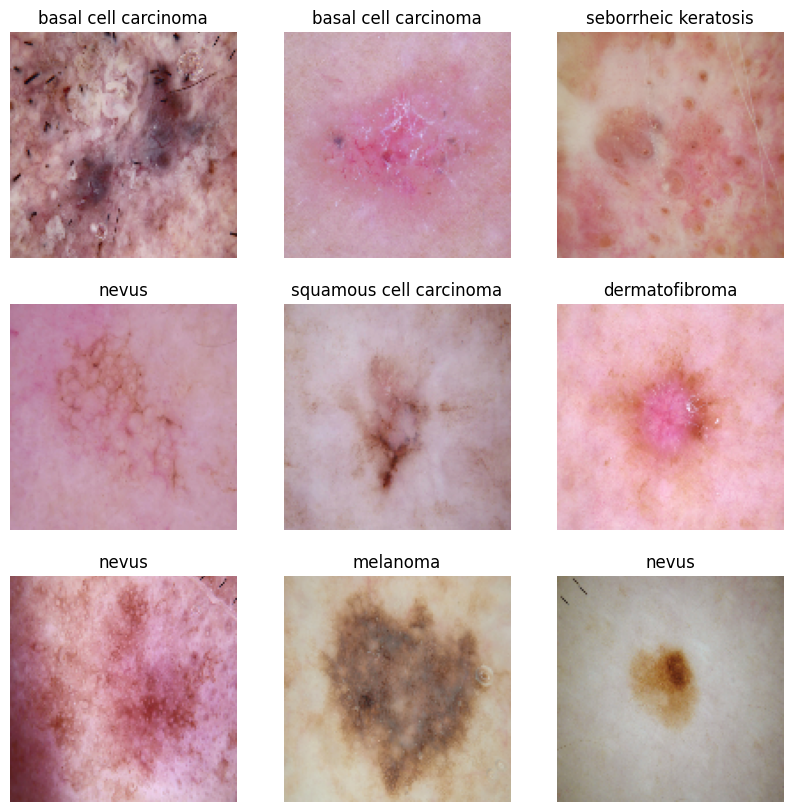
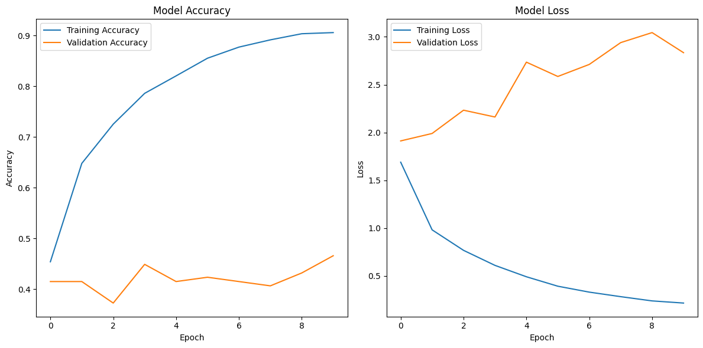

# Skin-Cancer-and-Pneumonia-Detection
This project applies deep learning to medical imaging with two models: a CNN for pneumonia detection from chest X-rays (binary classification) and a fine-tuned ResNet50 for multi-class skin disease identification. Both use a standardized pipeline (preprocessing, augmentation, training) with TensorFlow/Keras, demonstrating AI's healthcare potential 

# Skin Cancer Classifier (ResNet50)

## Overview

This project focuses on building and evaluating a deep learning model for the classification of skin lesion images. The model is designed to differentiate between nine distinct skin conditions. The methodology employs **transfer learning**, a powerful technique that leverages a pre-trained **ResNet50** model to accelerate the training process and improve performance on a new, specialized task.

## Dataset

The dataset used in this project is a subset of the **ISIC Skin Cancer Dataset**, which can be found on [Kaggle](https://www.kaggle.com/datasets/nodoubttome/skin-cancer9-classesisic).

**Dataset Details:**
* **Total Classes:** 9 (actinic keratosis, basal cell carcinoma, dermatofibroma, melanoma, nevus, pigmented benign keratosis, seborrheic keratosis, squamous cell carcinoma, vascular lesion)
* **Training Images:** 2,239
* **Test Images:** 118

## Methodology

### Data Preprocessing
All images were preprocessed to a uniform size of $128 \times 128$ pixels, and their pixel values were normalized to a range of 0 to 1 to optimize model training.

### Model Architecture
The model's architecture is based on **transfer learning** with **ResNet50**. The convolutional layers of the ResNet50 base were frozen, and custom classification layers were added on top.

### Training
The model was compiled with the `Adam` optimizer and `Categorical Crossentropy` loss function. It was trained for 10 epochs.

---

## Key Findings & Results

The training process showed a significant issue of **overfitting**. As seen in the plot below, the model's accuracy on the training data consistently increased, while the accuracy on the validation data remained low and unstable. This indicates the model was memorizing the training data instead of learning generalizable features.

* **Final Test Accuracy:** 46.61%
* **Final Test Loss:** 2.8345

---

## Future Improvements

To improve the model's performance and mitigate overfitting, the following steps are recommended:
1.  **Data Augmentation:** Apply techniques such as random rotations, flips, and shifts to expand the training dataset.
2.  **Hyperparameter Tuning:** Adjust the learning rate and other training parameters.
3.  **Regularization:** Introduce `Dropout` layers to the custom classification layers to further prevent overfitting.
4.  **Fine-Tuning:** Unfreeze and retrain the top layers of the ResNet50 base model with a very low learning rate.

## Libraries Used
* TensorFlow
* Keras
* NumPy
* Matplotlib

Dataset
The model was trained and evaluated on a subset of the Kaggle Chest X-Ray Images Dataset, which can be found here: Chest X-ray Images (Pneumonia). The dataset is structured into three main directories: train, test, and val, each containing subdirectories for the NORMAL and PNEUMONIA classes.

Methodology
Data Preprocessing
Images were prepared for the model using TensorFlow's ImageDataGenerator. This involved:

Rescaling image pixel values to a range of 
0
 to 
1
.
Resizing all images to a uniform size of 
128
×
128
 pixels.
Model Architecture
A simple CNN was constructed with the following layers:

Two Convolutional Layers: These layers use relu activation to extract features from the images. Each is followed by a MaxPooling layer to downsample the feature maps.
Flatten Layer: This prepares the data for the final classification layers.
Dense Layers: A hidden dense layer with relu activation, followed by an output layer with a sigmoid activation function for binary classification.
Training
The model was compiled with the adam optimizer and binary_crossentropy loss. It was trained for 10 epochs.

Key Findings & Results
The model was evaluated on an independent test dataset, achieving a solid performance. ROC Curve for Pneumonia Detection

Final Test Accuracy: 72.92%
Area Under the Curve (AUC): 0.78
The ROC curve, with an AUC of 0.78, indicates that the model is performing significantly better than random chance at differentiating between the two classes.

Project Structure
The dataset and code are organized as follows:

├── chest_xray/
│   ├── train/
│   │   ├── NORMAL/
│   │   └── PNEUMONIA/
│   ├── test/
│   │   ├── NORMAL/
│   │   └── PNEUMONIA/
│   └── val/
│       ├── NORMAL/
│       └── PNEUMONIA/
└── pneumonia_detection.py
Libraries Used
TensorFlow
Keras
NumPy
Matplotlib
Scikit-learn
